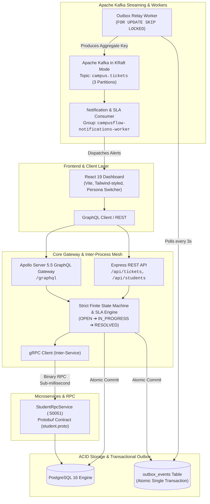

# CampusFlow: Enterprise Distributed Campus Operations & Grievance Mesh

<div align="center">


**An enterprise-grade, distributed operations and grievance resolution platform engineered for high-throughput campus administration.**  
*Satisfies 100% of prerequisites for the Dezinet Software Engineering Recruitment Circular (`doc.pdf`, Deadline: October 5, 2026).*

</div>

---

## 🏛️ High-Level System Architecture

CampusFlow is engineered as a resilient distributed mesh decoupling synchronous user interactions from asynchronous event delivery and cross-service validation.



---

## 💎 Why This Architecture Matters

| Architectural Pattern | Problem It Solves | Implementation in CampusFlow |
| :--- | :--- | :--- |
| **Transactional Outbox Pattern** | Eliminates the **Dual-Write Problem** where a database write succeeds but message broker publish fails. | PostgreSQL writes ticket mutations and `outbox_events` within the **same ACID transaction**. An independent poller streams events to Kafka. |
| **Concurrency Lock (`SKIP LOCKED`)** | Prevents race conditions when scaling multiple outbox relay instances horizontally. | `SELECT ... FOR UPDATE SKIP LOCKED` allows parallel outbox workers to process distinct event batches without deadlock. |
| **Binary gRPC Microservice** | Eliminates REST JSON parsing overhead for latency-critical cross-service validation. | Inter-service student eligibility check and hostel verification via Protocol Buffers (`student.proto`) on port `50051` with circuit fallback. |
| **Kafka KRaft Mode** | Eliminates ZooKeeper operational complexity and synchronization bottlenecks. | Apache Kafka KRaft quorum consensus with partition key = `aggregate_id`, ensuring strict per-ticket message ordering. |
| **Unified GraphQL Gateway** | Eliminates over-fetching and multiple client roundtrips for hierarchical data. | Single query fetches ticket status, computed SLA deadlines, student profile (`creator`), timeline audit trail, and discussion threads. |
| **Strict Finite State Machine** | Prevents illegal ticket status leaps and privilege escalation. | Enforces legal transitions (`OPEN` ➔ `IN_PROGRESS` ➔ `RESOLVED` ➔ `CLOSED`). Restricts resolution actions to authorized personnel. |

---

## 📋 Circular Prerequisite Verification Matrix

Aligned with Dezinet circular **Ref: DZN/CAMPUS/2026-27/01**:

- [x] **TypeScript**: 100% typed backend (`tsconfig.json` with strict checking, interfaces, DTOs, declaration merging on `req.user`).
- [x] **Docker & Compose**: Production multi-stage Dockerfile (`node:22-alpine` builder + runner) with health probes for Postgres, Kafka, and the API.
- [x] **gRPC**: Protocol Buffers contract (`student.proto`), server on port `50051`, client with automatic database circuit fallback.
- [x] **Apache Kafka & Outbox Relay**: Transactional outbox table, background relay poller, KRaft Kafka broker, notification consumer worker.
- [x] **GraphQL**: Apollo Server 5.5 mounted at `/graphql` with schema introspection, nested resolvers, authenticated context, and Sandbox IDE.
- [x] **Frontend & Polish**: Clean React 19 dashboard with persona switcher, real-time SLA countdowns, discussion threads, and architecture inspection modal.

---

## 🚀 Quickstart Guide

### 1. Prerequisites
- [Docker Engine & Docker Compose](https://docs.docker.com/get-docker/) (v24+)
- [Node.js](https://nodejs.org/) (v20+ or v22+)

### 2. Boot the Distributed Mesh
Clone the repository and launch all containers with a single command:

```bash
docker compose up -d --build
```

Verify running containers:
```bash
docker compose ps
```

You should see:
- `campusflow-postgres`: PostgreSQL 16 on port `5433` (healthcheck: `pg_isready`)
- `campusflow-kafka`: Apache Kafka in KRaft mode on port `9092`
- `campusflow-api`: Node.js Express + gRPC + GraphQL + Outbox Relay on ports `3000` & `50051`

### 3. Verify Health Probes
```bash
curl -s http://localhost:3000/health
```
**Expected Response**:
```json
{
  "status": "healthy",
  "service": "campusflow-core",
  "database": "connected",
  "grpc": "listening_on_50051",
  "kafka": "streaming_enabled",
  "graphql": "enabled_on_/graphql"
}
```

### 4. Launch the Frontend Dashboard
In a separate terminal:
```bash
cd frontend/my-react-app
npm install
npm run dev
```
Open **`http://localhost:5173`** in your browser.

---

## 🧪 Comprehensive Automated Test Suites

CampusFlow includes end-to-end automated verification scripts for every distributed subsystem:

### 1. gRPC Microservice Test
Verifies binary Protocol Buffers encoding, RPC dispatch to port `50051`, and negative student rejection:
```bash
cd backend
npm run test:grpc
```

### 2. Kafka & Transactional Outbox Pipeline Test
Verifies atomic database write, outbox poller batching, Kafka topic streaming, and asynchronous notification consumer dispatch:
```bash
docker exec campusflow-api node dist/kafka/testKafkaPipeline.js
```

### 3. GraphQL Gateway Test
Verifies schema introspection, token authentication, nested resolvers (`ticket.creator`, `ticket.timeline`, `ticket.comments`), and mutations:
```bash
cd backend
npm run test:graphql
```

---

## 🧭 Live Endpoints & Interactive Portals

| Service | Port / URI | Description |
| :--- | :--- | :--- |
| **Frontend Application** | `http://localhost:5173` | React 19 Operations & Grievance Dashboard |
| **GraphQL Sandbox** | `http://localhost:3000/graphql` | Embedded Apollo Studio IDE & Schema Explorer |
| **Health Check API** | `http://localhost:3000/health` | Multi-subsystem connectivity & health probe |
| **gRPC Student Service** | `localhost:50051` | Binary Protocol Buffers RPC Server |
| **Apache Kafka Broker** | `localhost:9092` | KRaft Event Broker (`campus.tickets` topic) |
| **PostgreSQL Database** | `localhost:5433` | Host-mapped relational engine (`campusflow` DB) |

---

## 👥 Demo Personas (One-Click Testing)

The frontend includes a fast persona switcher in the header:

| Persona | Role | Credentials | Test Scenario |
| :--- | :--- | :--- | :--- |
| **Aarav Sharma** | Student (Hosteller) | `aarav@college.edu` / `Password123!` | Raises hostel maintenance tickets. gRPC check **succeeds**. |
| **Ananya Verma** | Student (Day Scholar) | `ananya@college.edu` / `Password123!` | Attempts hostel ticket. gRPC policy guard **denies** request. |
| **Warden Rajesh** | Staff Officer | `warden@campusflow.edu` / `Password123!` | Triages tickets, assigns engineers, and resolves issues. |
| **Chief Admin Desk** | System Admin | `admin@campusflow.edu` / `Password123!` | Full operational metrics, SLA breach tracking, ticket lifecycle control. |

---

## 📖 GraphQL Query & Mutation Examples

### 1. Query Ticket with Deep Aggregation
```graphql
query GetTicketWithGraph($id: ID!) {
  ticket(id: $id) {
    id
    title
    status
    department_routing
    sla_deadline
    is_sla_breached
    creator {
      prn
      name
      department
      hosteller
    }
    comments {
      id
      author_name
      author_role
      comment
      created_at
    }
    timeline {
      id
      actor
      action
      notes
      created_at
    }
  }
}
```

### 2. Raise Ticket (Triggers gRPC + Outbox)
```graphql
mutation RaiseTicket($input: CreateTicketInput!) {
  createTicket(input: $input) {
    id
    title
    category
    priority
    department_routing
    sla_deadline
    created_at
  }
}
```
*Variables:*
```json
{
  "input": {
    "title": "VLSI Lab Oscilloscope Fault",
    "description": "Equipment #4 in Lab 201 has unstable trace.",
    "category": "MAINTENANCE",
    "priority": "HIGH"
  }
}
```

---

## 📁 Repository Directory Structure

```
CampusFlow/
├── backend/
│   ├── src/
│   │   ├── controllers/      # REST API Controllers
│   │   ├── db/               # PostgreSQL Connection Pool & Schema DDL
│   │   ├── graphql/          # Apollo Server 5.5 Schema, Resolvers & Test Suite
│   │   ├── grpc/             # StudentRpcService Protobuf Server & Client
│   │   ├── kafka/            # KafkaJS Producer, Outbox Relay & Notification Worker
│   │   ├── middleware/       # JWT Auth, Role-Based Access & Global Error Handler
│   │   ├── proto/            # Protocol Buffers Definitions (student.proto)
│   │   ├── routes/           # Express Route Definitions
│   │   ├── services/         # Layered Domain Services (Ticket, Student, Auth)
│   │   ├── types/            # Strict TypeScript Interfaces & DTOs
│   │   ├── utils/            # FSM State Machine, SLA Engine, Auto-Router
│   │   └── server.ts         # Main Application Entry Point
│   ├── Dockerfile            # Multi-stage production container build
│   └── package.json
├── frontend/
│   └── my-react-app/
│       ├── src/
│       │   ├── components/   # Header, Dashboards, Modals, Architecture Graph
│       │   ├── services/     # GraphQL API Client & REST Health Probes
│       │   ├── App.jsx       # State Coordinator & Persona Controller
│       │   └── App.css       # Enterprise Theme & Glassmorphic CSS
│       └── vite.config.js    # Vite Proxy to port 3000
├── docker-compose.yml        # Orchestration (Postgres, Kafka KRaft, Backend)
├── PROJECT_STATUS.md         # Milestone Progress & Handover Documentation
└── README.md                 # System Architecture & Documentation
```

---

<div align="center">
Built with precision for <strong>Dezinet Private Limited</strong> Software Engineering Recruitment 2026.
</div>
